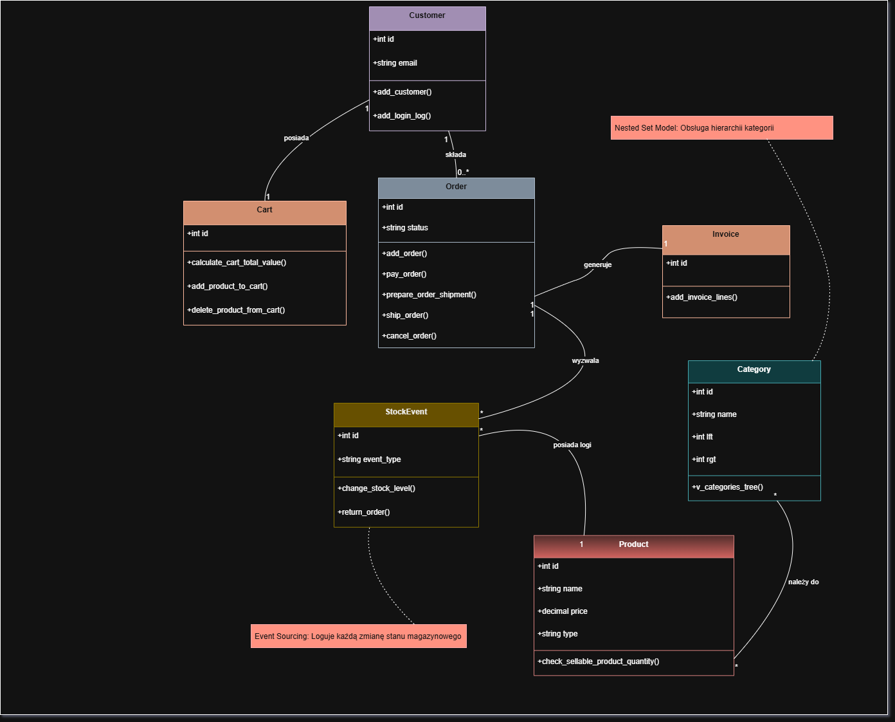

# E-Commerce Clothing Store: Thick Database Architecture

[](https://mariadb.org/)
[](https://www.python.org/)
[](https://www.docker.com/)
[](https://streamlit.io/)
[](https://docs.pytest.org/)

## Table of Contents
1. [About The Project](#about-the-project)
2. [Key Architectural Concepts](#key-architectural-concepts)
3. [Project Structure](#project-structure)
4. [Getting Started (Full Docker Deployment)](#getting-started-full-docker-deployment)
5. [Local Development (Without App Container)](#local-development-without-app-container)
6. [Testing](#testing)
7. [Database Dictionary](#database-dictionary)

---

## About The Project

This repository contains a fully functional e-commerce backend system designed around the **Thick Database** architectural pattern. Instead of relying on a middleware application layer to handle business logic, this system leverages the power of the relational database engine (MariaDB 11/InnoDB). 

The core logic consists of over 2,600 lines of SQL code encapsulating advanced paradigms such as Event Sourcing for inventory management and Nested Sets for hierarchical category structuring. A lightweight Python/Streamlit interface acts solely as a stateless presentation layer, delegating all ACID-compliant transactional operations to Stored Procedures.

## Key Architectural Concepts

* **Thick Database Pattern**: Business logic, data validation, and automated invoice generation are strictly enforced via SQL Procedures, Functions, and Triggers.
* **Event Sourcing (Inventory)**: Stock levels are not overwritten. The `stock_events` table acts as an append-only log of inventory changes (deliveries, sales, returns, cancellations). Current stock is dynamically aggregated via the `v_inventory` view to prevent overselling.
* **Nested Set Model**: The `categories` table uses a hierarchical tree structure (Nested Set) for optimized read operations of deeply nested clothing categories.
* **Infrastructure as Code (IaC)**: The entire ecosystem (Database + GUI) is containerized and orchestrated using Docker Compose, ensuring zero-configuration deployments.

---

## Project Structure

```text
.
├── materials/                  # Full documentation
├── .env.example                # Template for environment variables
├── app.py                      # Streamlit application (GUI)
├── docker-compose.yaml         # Container orchestration configuration
├── online_clothes_shop_db.sql  # Core database schema and stored procedures 
└── test_system.py              # Automated Pytest suite for database logic
```

---

## Class Diagram



---

## Getting Started (Full Docker Deployment)

This is the recommended method for running the complete system in an isolated environment.

1.  **Clone the repository**
    ```bash
    git clone [https://github.com/zephir-x/online-clothes-shop-db.git](https://github.com/zephir-x/online-clothes-shop-db.git)
    cd online-clothes-shop-db
    ```

2.  **Environment Configuration**  
    Create a `.env` file in the root directory to isolate sensitive data.
    ```env
    # example .env
    DB_ROOT_PASSWORD=rootpassword
    DB_NAME=ecommerce_db
    DB_USER=root
    DB_HOST=db
    DB_PORT=3306
    ```

3.  **Start the infrastructure**  
    Deploy the database and application containers in detached mode.
    ```bash
    docker compose up -d
    ```
    *Note: Upon the first startup, MariaDB will automatically execute the initialization SQL script. This process takes approximately 10-15 seconds.*

4.  **Access the Application**
    Open your web browser and navigate to:
    ```text
    http://localhost:8501
    ```

---

## Local Development (Without App Container)

If you wish to modify the Python code and see changes in real-time, you can run the database in Docker and the Streamlit application locally.

1.  **Start only the database container**
    ```bash
    docker-compose up -d db
    ```

2.  **Update Environment Variables**  
    In your local `.env` file, change the database host from `db` to `127.0.0.1` to access the exposed container port:
    ```
    DB_HOST=127.0.0.1
    ```

3.  **Install Python Dependencies**  
    Initialize a virtual environment and install required packages:
    ```bash
    python -m venv .venv
    .\.venv\Scripts\Activate.ps1
    pip install streamlit mysql-connector-python pymysql pytest python-dotenv
    ```

4.  **Run the Streamlit App**
    ```
    streamlit run app.py
    ```

---

## Testing

The database core is verified using 8 automated tests (Unit, Integration, E2E). These tests identified and helped fix critical issues like transaction conflicts (Error 1644) and collation mismatches.

1.  **Install Testing Dependencies**
    Ensure your virtual environment is active and run:
    ```bash
    pip install pytest pymysql python-dotenv
    ```

2.  **Execute the Test Suite**
    Ensure your virtual environment is active and run:
    ```bash
    pytest test_system.py -v -s
    ```

---

## Database Dictionary

### Configuration
* **DBMS**: MySQL / MariaDB 11
* **Engine**: InnoDB
* **Collation**: `utf8mb4_general_ci` (Enforced via server configuration to prevent Collation Mismatch)

### Tables
* `addresses`: Customer saved addresses for autofilling payment and shipping details.
* `attributes`: Product attributes (size, color, etc.).
* `billing_details`: Payment data.
* `cart`: Customer carts (one per order, features ON DELETE CASCADE).
* `cart_item`: Items within a specific cart.
* `categories`: Product categories (implemented using Nested Set).
* `category_product`: Pivot table mapping products to categories.
* `customers`: E-commerce shop customers.
* `invoice_lines`: Individual bought product information (tax, net price).
* `invoices`: Customer invoices (generated automatically when an order is paid).
* `login_history`: Users and customers login timestamps (Work In Progress).
* `orders`: Customer orders.
* `payment_providers`: Available payment methods/providers.
* `permissions`: System access permissions.
* `product_attribute`: Pivot table mapping products to attributes.
* `products`: Information about clothes (configurable & simple types).
* `role_permission`: Pivot table mapping roles to permissions.
* `role_user`: Pivot table mapping users to roles.
* `roles`: Grouped permissions assigned to internal users.
* `shipping_details`: Shipment data.
* `shipping_providers`: Shipping companies.
* `stock_events`: Stock level history logs (Event Sourcing).
* `users`: E-commerce shop workers/administrators.
* `vendors`: Product manufacturers.

### Views
* `v_categories_tree`: Hierarchical representation of categories.
* `v_customer_orders`: Customer orders with aggregated info.
* `v_inventory`: Current stock levels dynamically calculated from `stock_events`.
* `v_order_details`: Detailed order view (products, quantities, prices).
* `v_permission_IDs`: Helper view mapping permissions.
* `v_product_details`: Extended product info (attributes, categories, vendor).
* `v_role_IDs`: Helper view mapping roles.
* `v_user_IDs`: Helper view mapping users.
* `v_user_roles`: Helper view mapping roles to users.
* `v_role_permissions`: Helper view mapping permissions to roles.

### Functions
* `calculate_cart_total_value`: Calculates total cart value (gross/net).
* `check_billing_details`: Validates billing data.
* `check_sellable_product_quantity`: Checks if requested product quantity is currently available in stock.
* `check_shipping_details`: Validates shipping data.
* `generate_email`: Generates random email address.
* `generate_random_date`: Generates random date within a specified range.
* `generate_random_hashed_password`: Generates a hashed password string.
* `generate_random_ip`: Generates a random IP address.
* `generate_random_number`: Generates a random number within a specified range.
* `generate_random_user_agent`: Generates a random user agent string.
* `generate_tracking_url`: Generates a shipment tracking URL.
* `generate_transaction_id`: Generates a transaction ID for external payment gateways.
* `remove_diacritics`: Removes diacritics from text fields.

### Procedures
* `add_billing_details`: Adds billing details for a customer without a saved address.
* `add_customer`: Creates a new customer entity.
* `add_invoice_lines`: Generates invoice line entries.
* `add_login_log`: Stores login history for a user/customer.
* `add_order`: Creates a new order with `status='placed'`.
* `add_product_to_cart`: Adds or updates a product's quantity in an active cart.
* `add_role_permission`: Assigns a permission to a specific role.
* `add_role_user`: Assigns a role to a specific user.
* `add_shipping_details`: Adds shipping details to an order.
* `add_user`: Creates a new internal user entity.
* `cancel_order`: Cancels an order (if not shipped) and logs a compensation stock event.
* `change_stock_level`: Updates stock based on diverse order events.
* `delete_product_from_cart`: Soft deletes a product from a cart.
* `increase_quantity`: Increases product quantity in an active cart.
* `pay_order`: Processes payment, automatically generates an invoice with lines, and sets `status='paid'`.
* `prepare_order_shipment`: Generates a tracking link and sets `status='ready_to_ship'`.
* `return_order`: Handles returned orders and logs a restock event.
* `ship_order`: Sets order `status='shipped'`.